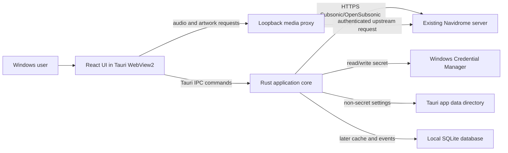
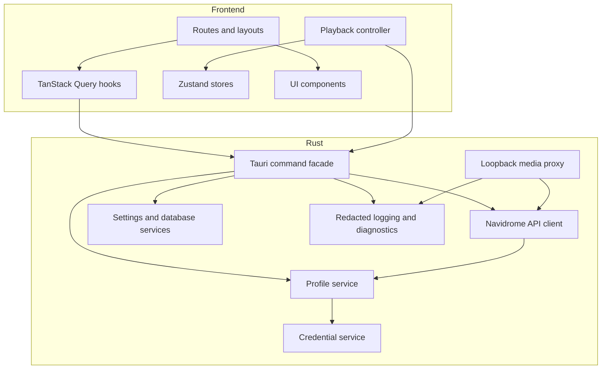
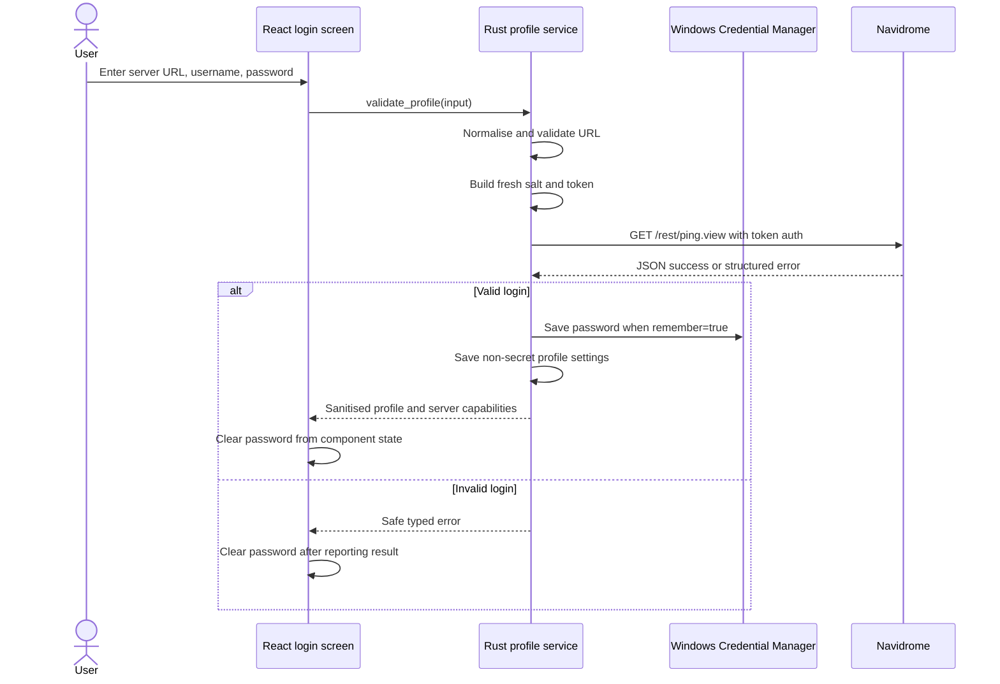

# Navidrome Desktop - Technical Architecture

## Document status

- Scope: architecture for a Windows-first Navidrome desktop client
- Development model: local Cursor project on the Windows desktop
- Runtime model: local installed application connecting to an existing Navidrome server
- Architecture style: Tauri 2 application with a React/TypeScript webview and a Rust backend
- Initial server protocol: supported Subsonic/OpenSubsonic-compatible REST endpoints exposed by Navidrome
- Working package identifier: `com.burtonsvilla.navidrome-desktop`
- Subsonic client identifier: `burtonsvilla-desktop`

The package identifier and client identifier are working values. Rename them once a permanent product name is selected, before distributing builds broadly.

## 1. Architectural decision summary

The application will be built and run locally on Windows. It will not run in a container, LXC, VM, or service on the home server.

Navidrome remains the remote server and source of truth. The desktop application consists of:

1. A React and TypeScript user interface rendered by Windows WebView2 through Tauri.
2. A Rust backend embedded in the same installed application.
3. A Rust Navidrome client that performs authenticated API requests.
4. Windows Credential Manager storage for the remembered Navidrome password.
5. A loopback-only Rust media proxy for artwork and audio streaming.
6. Local non-secret settings and, in later phases, a local SQLite cache and listening-event database.

The frontend must not call Navidrome directly. It invokes a small, typed set of Tauri commands. This avoids browser CORS problems, centralises authentication and redaction, and prevents reusable Navidrome authentication parameters from being exposed in the DOM or JavaScript logs.

## 2. System context



There is no new remote backend between the desktop application and Navidrome.

## 3. Deployment model

### 3.1 Source and development

The repository lives in a normal Windows folder, for example:

```text
C:\Users\<user>\Projects\navidrome-desktop
```

Cursor opens this folder directly. Development commands run in the local Windows terminal integrated with Cursor.

Do not develop this project through Remote SSH to a Proxmox container. Do not create a Docker Compose stack for it. The build requires access to the local Windows toolchain because Tauri produces a Windows executable and installer.

### 3.2 Installed application

A production build contains:

- The compiled Rust/Tauri executable.
- Bundled frontend assets.
- Required icons and resources.
- An NSIS or MSI installer produced by Tauri.

At runtime, the app stores only local user-specific data in the Tauri application directories and Windows Credential Manager.

### 3.3 Home-server impact

No home-server change is part of the application build.

The existing Navidrome address only needs to:

- Be reachable from the desktop.
- Present a valid TLS certificate for HTTPS use.
- Pass `/rest/*` requests to Navidrome.
- Permit normal audio streaming and HTTP range requests through the reverse proxy.
- Use Navidrome's own account authentication for this initial design.

If a reverse proxy later adds a separate login page, forward-auth layer, or externalised authentication in front of `/rest/*`, that becomes a separate integration project. The desktop client must not scrape a proxy login page.

## 4. Technology stack

### 4.1 Core stack

| Layer | Choice | Reason |
|---|---|---|
| Desktop shell | Tauri 2 | Small native package, Rust backend, Windows window/tray APIs |
| Frontend | React + TypeScript + Vite | Mature UI ecosystem and strong Cursor support |
| Server-state fetching | TanStack Query | Caching, retries, cancellation, stale data, invalidation |
| Client state | Zustand | Small predictable store for queue, playback, and UI state |
| Validation | Zod | Runtime validation at frontend boundaries |
| Styling | CSS variables plus CSS Modules | Controlled custom music UI without a heavy visual framework |
| Rust HTTP client | `reqwest` | Async HTTPS, streaming responses, timeouts, connection pooling |
| Rust serialisation | `serde` and `serde_json` | Typed API models |
| Rust errors | `thiserror` | Structured internal error types |
| Hashing and IDs | `sha2`, protocol-required MD5, and `uuid` | Stable profile IDs, Subsonic auth, playback sessions |
| Logging | `tracing` with explicit redaction | Structured diagnostics without secret leakage |
| Credential storage | Rust keyring ecosystem using Windows native store | Password remains in Windows Credential Manager |
| Non-secret settings | Official Tauri Store plugin | Small persistent settings with Tauri path handling |
| Local database, later | SQLite owned by Rust | Cached metadata, local queue snapshots, playback events, migrations |
| Tests | Vitest, React Testing Library, Rust unit/integration tests | Fast feedback across both halves of the app |

### 4.2 Version policy

- Use the latest stable dependency versions available when the repository is created.
- Tauri must never be below `2.11.1`, because earlier Tauri 2 releases include a patched origin-classification vulnerability.
- Commit `package-lock.json` and `Cargo.lock`.
- Do not use floating Git dependencies for production code without an explicit architecture decision.
- Record Node, npm, Rust, and Tauri versions in `DEVELOPMENT.md` after scaffolding.

## 5. Trust boundaries

The main trust boundaries are:

1. **User to local UI**: user enters server URL, username, and password.
2. **Webview to Rust**: only declared Tauri commands are allowed.
3. **Rust to Navidrome**: all remote input is untrusted and must be parsed defensively.
4. **Rust to Windows Credential Manager**: password is stored under the current Windows account.
5. **Webview to loopback proxy**: only a per-process token and permitted media identifiers are accepted.
6. **Local files**: settings and databases are untrusted on read and require schema validation/migration.

A compromise of the user's Windows account is outside the app's protection boundary, but the app should still avoid making credential theft easier through plaintext files or logs.

## 6. High-level component model



## 7. Authentication architecture

### 7.1 Supported initial authentication mode

The first release uses normal Subsonic token-and-salt authentication backed by the user's Navidrome username and password.

For each API request, the Rust client supplies:

- `u`: username.
- `t`: lower-case MD5 of UTF-8 password concatenated with the fresh salt.
- `s`: fresh cryptographically random salt, at least 16 random bytes encoded as lower-case hexadecimal.
- `v`: `1.16.1`.
- `c`: `burtonsvilla-desktop`.
- `f`: `json` for JSON endpoints.

The clear-text `p` parameter is prohibited outside an isolated test fixture.

### 7.2 Login flow



### 7.3 Credential storage

Use a Windows-native credential entry through Rust.

Recommended coordinates:

- Service: `com.burtonsvilla.navidrome-desktop`
- Account: stable `profile_id`
- Secret: Navidrome password only

`profile_id` should be a SHA-256 digest of:

```text
normalised_server_url + newline + navidrome_username
```

Non-secret profile data contains:

- Profile ID.
- Normalised server URL.
- Username.
- Friendly display name if added later.
- Last successful connection timestamp.
- Server type/version and reported OpenSubsonic capabilities.
- Whether the credential should be remembered.

The password must not be serialised with the profile.

### 7.4 In-memory secret handling

- Accept the password in one Tauri login command.
- Avoid cloning it unnecessarily.
- Use a secret wrapper or `zeroize` for Rust buffers where practical.
- Do not return it to the frontend.
- Clear the frontend password field and form state immediately after the command resolves.
- Do not include command arguments in logs.
- Serialise access to a single credential entry to avoid Windows keyring ordering issues.

### 7.5 Session restoration

At startup:

1. Load the current non-secret profile.
2. If it is marked remembered, request its secret from Credential Manager.
3. Run a bounded `ping` request.
4. If successful, enter the application.
5. If the password is missing or invalid, show the login screen with server URL and username prefilled but no password.
6. Do not run an unbounded automatic retry loop.

### 7.6 Future authentication modes

Future optional modes may include:

- OpenSubsonic API key authentication when the server advertises the extension and Navidrome supports it.
- Reverse-proxy Basic Authentication.
- Externalised authentication.

Each must be implemented as an explicit credential strategy, not as ad hoc headers mixed into the normal strategy.

## 8. Navidrome API client

### 8.1 Design

Create one Rust `NavidromeClient` per active profile or a shared client whose immutable connection context is the profile.

The client owns:

- A pooled `reqwest::Client`.
- Normalised base URL.
- Username.
- Secret provider reference.
- Client identifier and protocol version.
- Timeouts.
- Capability information.
- Redaction-aware tracing.

The client must provide domain methods rather than a generic arbitrary-URL command exposed to JavaScript.

Good:

```text
get_newest_albums(limit, offset)
get_album(album_id)
search(query, limits)
star_song(song_id)
```

Prohibited frontend API:

```text
fetch_any_navidrome_url(url, query, headers)
```

### 8.2 URL construction

- Use a URL library; do not concatenate untrusted strings into URLs.
- Preserve an optional Navidrome base path.
- Add endpoint paths beneath `/rest/`.
- Add query parameters through URL encoding APIs.
- Generate a fresh auth salt and token after all non-auth query parameters are prepared.
- Never log the final authenticated URL.
- For diagnostics, log only method name, endpoint name, duration, HTTP status, and a request correlation ID.

### 8.3 Initial endpoint allowlist

Milestone 1 needs:

- `ping`
- `getOpenSubsonicExtensions`, where available without authentication
- `getMusicFolders`
- `getAlbumList2` with `type=newest`
- `getAlbum`
- `getCoverArt`
- `stream`
- `scrobble`

Later phases add:

- `search3`
- `getArtists`
- `getArtist`
- `getGenres`
- `getAlbumList2` variants
- `getRandomSongs`
- `getStarred2`
- `star` and `unstar`
- `setRating`
- Playlist endpoints
- `getPlayQueue` and `savePlayQueue`
- Similar-song and lyrics endpoints

### 8.4 ID handling

All server identifiers are opaque strings.

- TypeScript types use `string`.
- Rust models use `String` or a small string newtype.
- Database columns use text.
- Never parse IDs as integers.
- Never sort IDs numerically.

### 8.5 Response envelope

JSON responses are wrapped in `subsonic-response`.

The Rust layer should:

1. Parse the top-level envelope.
2. Check `status` even when HTTP status is 200.
3. Convert known error codes into typed application errors.
4. Preserve a safe server message when present.
5. Validate expected payload presence for successful calls.
6. Treat malformed success responses as protocol errors.

Suggested application error categories:

- `InvalidCredentials`
- `UnsupportedAuthentication`
- `PermissionDenied`
- `NotFound`
- `IncompatibleProtocol`
- `ServerUnavailable`
- `DnsFailure`
- `TlsFailure`
- `Timeout`
- `MalformedResponse`
- `RateLimited`
- `Cancelled`
- `UnknownServerError`

### 8.6 Retries

- Do not automatically retry invalid credentials or permission failures.
- Retry safe GET metadata requests at most twice with jittered backoff.
- Do not automatically retry a mutation unless it has idempotency protection.
- Playback proxy requests should fail quickly enough for the player to show an actionable error.
- Scrobble retries use a bounded local outbox and a unique playback-session key to prevent duplicates.

## 9. Media and artwork proxy

### 9.1 Why a proxy is required

Directly placing an authenticated Navidrome stream URL into the webview would expose a reusable salt/token pair in JavaScript and DOM state. It would also make Web Audio visualisation dependent on remote CORS behaviour.

Instead, Rust starts a narrowly scoped HTTP server on loopback for the lifetime of the application.

### 9.2 Binding and address

- Bind only to `127.0.0.1` on an operating-system-assigned port.
- Never bind to `0.0.0.0`, a LAN address, or IPv6 wildcard.
- Generate a random 256-bit session token on each application start.
- Return a sanitised proxy base URL to the frontend.
- Include the session token in an unguessable path segment because an HTML media element cannot attach a custom authorization header.

Example shape:

```text
http://127.0.0.1:<random-port>/<session-token>/stream/<song-id>
http://127.0.0.1:<random-port>/<session-token>/cover/<cover-id>
```

The session token is not a Navidrome credential. It expires when the process exits.

### 9.3 Allowed methods and routes

Allow only:

- `GET` and, if needed by WebView2, `HEAD`.
- `/stream/:song_id`
- `/cover/:cover_id`
- A small `/health` route that does not reveal configuration.

Reject:

- Arbitrary upstream URLs.
- Path traversal.
- Unknown methods.
- Missing or incorrect session token.
- Oversized identifiers.
- Requests with unexpected bodies.

### 9.4 Audio streaming

The stream proxy must:

1. Validate the local session token and song ID.
2. Forward the browser's `Range` header when present.
3. Make an authenticated upstream Navidrome `stream` request.
4. Stream bytes without buffering the entire track in memory.
5. Preserve safe media headers:
   - `Content-Type`
   - `Content-Length`
   - `Content-Range`
   - `Accept-Ranges`
   - `ETag`
   - `Last-Modified`
   - relevant cache headers
6. Preserve appropriate `200` or `206` status.
7. Strip cookies, upstream server details, and authenticated URLs.
8. Cancel the upstream response when the browser disconnects.
9. Apply read and connection timeouts without terminating a healthy long stream.

### 9.5 Artwork

Artwork uses the same loopback proxy, with browser caching enabled where safe.

- Allow requested size parameters from a small validated range.
- Use a stable local URL per cover and size within the process.
- Forward ETag or Last-Modified when present.
- Provide an application fallback image for missing artwork.
- Add disk caching only in a later milestone.

### 9.6 CORS and CSP

The local proxy should allow only the known application origins needed for production Tauri and local Vite development. It must not use a wildcard CORS policy.

The Tauri Content Security Policy should permit:

- Application assets from self.
- Tauri IPC origins required by the framework.
- Media and images from `http://127.0.0.1:*`.
- Blob URLs only where required.

Do not disable CSP globally.

## 10. Playback architecture

### 10.1 Initial engine

The initial engine uses one HTML audio element owned by a top-level `PlayerProvider` in the main application window.

The main window is hidden rather than destroyed when close-to-tray is later enabled. Therefore the one audio element continues playing.

The mini player never creates another audio element. It communicates through shared state and Tauri events or commands.

### 10.2 Playback state model

Suggested state:

```text
status: idle | loading | playing | paused | stalled | ended | error
queue: QueueItem[]
currentIndex: number | null
currentTrack: Song | null
positionSeconds: number
durationSeconds: number
volume: 0..1
muted: boolean
shuffleMode: off | on
repeatMode: off | queue | one
playbackSessionId: UUID | null
proxyBaseUrl: string
error: PlayerError | null
```

Separate authoritative values from display values. The audio element is authoritative for current playback position and duration; Zustand mirrors them at a throttled rate for UI rendering.

### 10.3 Queue commands

Implement queue changes as pure tested functions:

- `replaceAndPlay(items, startIndex)`
- `playNext(items)`
- `append(items)`
- `removeAt(index)`
- `move(from, to)`
- `clear()`
- `setCurrent(index)`
- `advance(reason)`
- `goPrevious()`

Shuffle should preserve the identity of the currently playing item and maintain a reversible original order.

### 10.4 Playback session and scrobbling

Create a new `playbackSessionId` every time a track begins as a distinct queue occurrence.

Track:

- Accumulated actual playing time.
- Last wall-clock sample.
- Whether now-playing was reported.
- Whether completed submission was accepted.
- Retry state.

Do not use `currentTime` alone to determine listened duration because seeking can jump it forward.

Flow:

1. On the first actual `playing` event, send `submission=false` once.
2. Accumulate elapsed wall-clock time only while not paused, stalled, seeking, or hidden by an error.
3. When the product threshold is reached, enqueue `submission=true` with the playback session ID.
4. Mark submitted only after success or retain in a bounded retry outbox.
5. Never create a second completed submission for the same playback session.

### 10.5 Future advanced engine

MPV can be evaluated after the HTML engine is stable. It would be justified by proven needs such as:

- More reliable gapless playback.
- ReplayGain control.
- Output-device selection.
- Wider codec behaviour.
- Native audio filters.

The frontend player contract should avoid assuming that the HTML element is permanent, making a later engine adapter possible.

## 11. Frontend architecture

### 11.1 Routing

Suggested routes:

```text
/login
/home
/search
/albums
/albums/:albumId
/artists
/artists/:artistId
/tracks
/genres
/playlists
/playlists/:playlistId
/queue
/settings
```

The application shell and `PlayerProvider` sit above route content so navigation cannot unmount playback.

### 11.2 Server state

Use TanStack Query for:

- Current profile and capabilities.
- Home sections.
- Albums, artists, tracks, and playlists.
- Search results.
- Detail data.
- Favourites and ratings.

Query keys must include `profileId` to prevent cross-profile cache leakage when multi-profile support is added.

Default behaviour:

- Conservative metadata retry.
- Background refresh for stale home data.
- Explicit invalidation after successful mutations.
- Abort requests when a component's query is cancelled.
- No retry for typed auth errors.

### 11.3 Client state

Use small focused Zustand stores:

- `playbackStore`
- `queueStore`, or combined with playback if simpler
- `uiStore`
- `settingsStore`

Do not copy server collections into Zustand when TanStack Query already owns them.

### 11.4 Tauri command wrapper

All frontend calls go through one typed wrapper module, for example:

```text
src/lib/tauri/
  auth.ts
  library.ts
  playback.ts
  settings.ts
  errors.ts
```

This layer converts raw invoke errors into a consistent `AppError` and is the only place that imports Tauri `invoke` directly.

### 11.5 UI components

Create reusable components for:

- Artwork.
- Album card.
- Track row.
- Artist link.
- Loading skeleton.
- Empty state.
- Error state.
- Context menu.
- Favourite button.
- Rating control.
- Queue action menu.
- Persistent player.

Do not create a generic component abstraction before at least two real usages require it.

## 12. Local persistence

### 12.1 Phase 1 settings

Use the official Tauri Store plugin for non-secret settings:

```text
schemaVersion
currentProfileId
profiles[]
ui.theme
ui.windowState
player.volume
player.muted
player.repeatMode
player.shuffleMode
queueSnapshot
```

Validate the loaded object and fall back safely if it is corrupt.

### 12.2 SQLite database

SQLite is implemented for the profile-scoped metadata cache and local playback history. Rust owns the connection, enables WAL mode, applies forward-only schema migrations, replaces metadata cache rows transactionally, and exposes only typed commands.

Suggested tables:

```text
schema_migrations
profiles
metadata_cache
artwork_cache_index
queue_snapshots
playback_events
scrobble_outbox
mix_runs
mix_run_items
```

The Rust side owns database access. Do not expose arbitrary SQL to the frontend.

### 12.3 Playback events

A local playback event should record:

- Event ID.
- Profile ID.
- Playback session ID.
- Track ID.
- Event type.
- Timestamp.
- Position.
- Actual listened milliseconds.
- Source context, such as album, playlist, mix, or search.
- Mix reason when applicable.

No password, authenticated URL, or media bytes belong in the database.

The in-memory library index is rebuilt from the SQLite cache at session activation and after a bounded server refresh. It precomputes normalized searchable text across core metadata, genres, moods, comments, file type, display fields, and MusicBrainz ID. Filtering and sorting happen over the complete index before pagination so numeric duration and technical-metadata ordering are correct across the whole library.

## 13. Window and process architecture

### 13.1 Main window

- Owns the React application and one playback engine.
- Minimum usable size is enforced.
- The browser media element, queue, scrobble controller, and analyser remain mounted across route changes.
- Close-to-tray intercepts the close request and hides the window when the user enables it.

### 13.2 Mini-player window

- Created only when requested.
- Receives sanitised playback state through Tauri events.
- Sends control commands to the main playback owner.
- Supports always-on-top.
- Closing it destroys only the mini window, not playback.

### 13.3 Single instance

The official single-instance plugin focuses and shows the existing main window instead of starting a second playback process.

### 13.4 Tray lifecycle

The tray lifecycle is:

- The process exits only through an explicit Quit action or Windows shutdown.
- Tray commands control the one player.
- Hiding all windows does not stop audio.
- An app setting decides whether the window close button hides or exits.

## 14. Visualiser architecture

### 14.1 Audio graph

The media element connects once to a Web Audio graph:

```text
HTMLAudioElement -> MediaElementAudioSourceNode -> AnalyserNode -> AudioContext destination
```

The analyser is shared. Visualisers receive copied or read-only frame data and never reconnect the source node.

### 14.2 Internal plugin contract

Conceptual TypeScript contract:

```ts
export interface VisualizerPlugin {
  id: string;
  name: string;
  renderer: 'canvas2d' | 'webgl';
  mount(target: HTMLCanvasElement, context: VisualizerContext): void;
  resize(width: number, height: number, pixelRatio: number): void;
  render(frame: AudioAnalysisFrame): void;
  updateSettings(settings: Record<string, unknown>): void;
  destroy(): void;
}
```

`AudioAnalysisFrame` should contain only data required by rendering, such as frequency bins, waveform samples, timestamp, and normalised energy bands.

### 14.3 Safety and performance

- Bundle trusted modules at build time for the initial release.
- No `eval` or downloaded JavaScript.
- Cancel animation frames on unmount.
- Cap device pixel ratio for expensive scenes.
- Detect sustained frame drops and lower quality.
- Suspend analysis when no visualiser is visible.
- Respect reduced motion.

## 15. Mix engine architecture

### 15.1 Separation

The mix engine is a pure domain service. It should not depend directly on React components.

Inputs:

- Mix recipe.
- Seed track, artist, genre, year, or playlist.
- Candidate-provider results.
- Local playback and skip history.
- User settings.
- Requested queue length.

Output:

- Ordered queue items.
- Selection reason per item.
- Warnings for unavailable candidate sources.
- Debug score breakdown when diagnostics are enabled.

### 15.2 Candidate providers

Use a provider interface for sources such as:

- Starred tracks.
- Frequent tracks or smart playlists.
- Random tracks.
- Recently added content.
- Similar songs.
- Selected playlist.
- Local underplayed index.

This permits graceful degradation when a server does not support an extension.

### 15.3 Deterministic testing

Inject a seeded random number generator. Unit tests can then verify:

- No duplicates.
- Artist spacing.
- Source proportions within tolerance.
- Recent-play penalties.
- Filter compliance.
- Stable output for a fixed seed and candidate set.

Production runs use a cryptographically random seed recorded with the mix run so a queue can be reproduced for diagnostics.

## 16. Security controls

### 16.1 Tauri capabilities

- Grant only the capabilities required by the implemented feature set.
- Do not use broad shell or filesystem access.
- Do not expose a generic HTTP plugin to the frontend.
- Keep dangerous commands on the Rust side.
- Review capability diffs as security-sensitive changes.

### 16.2 Content Security Policy

- Keep CSP enabled in development and production.
- Permit only self, required Tauri origins, and the loopback media origin.
- Do not add wildcard remote domains merely to make artwork work.
- Do not enable remote navigation in the main webview.

### 16.3 URL validation and SSRF

The user intentionally chooses a server, so private addresses are valid. However:

- Only the configured profile host may be contacted by normal API methods.
- Reject URLs containing embedded credentials.
- Reject non-HTTP schemes.
- Do not follow redirects to a different host without explicit validation.
- Limit redirect count.
- Revalidate the final host for media requests.
- Never expose a generic local proxy route for arbitrary URLs.

### 16.4 Log redaction

A redaction layer must remove:

- Passwords.
- Credential-manager secrets.
- `p`, `t`, `s`, and future `apiKey` query values.
- Session tokens in loopback paths.
- Full authenticated URLs.
- Authorization and cookie headers.

Tests must assert redaction.

### 16.5 Dependency hygiene

- Run `npm audit` as information, not as an automatic source of unsafe blind upgrades.
- Run `cargo audit` when installed.
- Review Tauri security advisories before release.
- Keep the Tauri core above known patched versions.
- Avoid abandoned media-proxy plugins when a small auditable Rust module is sufficient.

## 17. Logging and diagnostics

Use structured logs with levels and correlation IDs.

Useful fields:

- Event name.
- Endpoint name.
- Duration.
- HTTP status.
- Safe error category.
- Profile ID hash or short identifier.
- Playback session ID.
- App version.

Do not log:

- Track stream URLs.
- Raw API query strings.
- Passwords or tokens.
- Entire server responses by default.

A later diagnostics export should include:

- App and dependency versions.
- Windows version.
- Sanitised profile host.
- Capability list.
- Recent redacted logs.
- Database schema version.
- Player and proxy health state.

## 18. Testing strategy

### 18.1 Rust unit tests

- URL normalisation.
- Profile ID derivation.
- Token generation using known vectors.
- Fresh salt format and length.
- Query redaction.
- Subsonic response parsing.
- Error-code mapping.
- Queue/scrobble idempotency helpers.
- Proxy route validation.
- Range-header forwarding rules.

### 18.2 Rust integration tests

Use a local mock HTTP server to test:

- Successful `ping`.
- Error 40 invalid credentials.
- Successful newest-album response.
- Malformed JSON.
- Timeout.
- Redirect to another host.
- `206 Partial Content` streaming.
- Upstream media failure.
- Scrobble success and retry.

No automated test should require the user's real Navidrome credentials.

### 18.3 Frontend unit tests

- Login validation and error display.
- Query loading, empty, and error states.
- Album card and track row behaviour.
- Queue pure functions.
- Player reducer/store transitions.
- Scrobble threshold accumulation.
- Password field clearing after invoke completion.

### 18.4 End-to-end smoke tests

Later add Webdriver or a supported Tauri test approach for:

- First-run login against a disposable mock server.
- Open album and start playback fixture.
- Main navigation while playback remains active.
- Logout and credential removal.

### 18.5 Manual tests against real Navidrome

Keep a release checklist for the user's server:

- HTTPS login.
- Artwork.
- Original-format stream.
- Seek through a track.
- Full album transition.
- Play-count change after qualifying playback.
- Invalid password.
- Server temporarily offline.
- App restart and queue restoration.

## 19. Suggested repository structure

```text
navidrome-desktop/
  .cursor/
    rules/
      project.mdc
  docs/
    decisions/
  src/
    app/
      App.tsx
      routes.tsx
      providers.tsx
    components/
    features/
      auth/
      home/
      albums/
      player/
      queue/
      settings/
    lib/
      tauri/
      errors/
      formatting/
    stores/
    styles/
    test/
  src-tauri/
    capabilities/
      default.json
    src/
      lib.rs
      main.rs
      app_state.rs
      commands/
        mod.rs
        auth.rs
        library.rs
        playback.rs
        settings.rs
      credentials/
        mod.rs
        windows.rs
      navidrome/
        mod.rs
        auth.rs
        client.rs
        error.rs
        models.rs
        endpoints.rs
      media_proxy/
        mod.rs
        routes.rs
        upstream.rs
      persistence/
        mod.rs
        settings.rs
      logging/
        mod.rs
        redaction.rs
    tests/
      navidrome_client.rs
      media_proxy.rs
    Cargo.toml
    tauri.conf.json
  AGENTS.md
  PRODUCT_SPEC.md
  ARCHITECTURE.md
  DEVELOPMENT.md
  package.json
  package-lock.json
  tsconfig.json
  vite.config.ts
```

Keep modules smaller than this outline when a feature is simple. The structure is a target boundary map, not a requirement to create empty files.

## 20. Development commands

The scaffold should expose consistent npm scripts:

```text
npm run dev              # Vite webview only when useful
npm run tauri dev        # Full local Windows application
npm run typecheck
npm run lint
npm run test
npm run test:watch
npm run format:check
npm run rust:fmt:check
npm run rust:clippy
npm run rust:test
npm run verify           # All non-interactive checks
npm run tauri build
```

`npm run verify` should be the standard pre-commit quality command and fail on any test, type, lint, formatting, or Clippy error.

## 21. Architecture decisions and trade-offs

### ADR-001: Local desktop app, not server-hosted web app

**Decision:** Build and run on Windows through Tauri.

**Reason:** The requested mini player, tray, global controls, and browser-free experience are desktop concerns. Navidrome already provides the remote server.

### ADR-002: Rust owns Navidrome networking

**Decision:** No direct frontend-to-Navidrome requests.

**Reason:** Centralises auth, prevents credential URL exposure, avoids CORS dependence, and enables a safe media proxy.

### ADR-003: Windows Credential Manager stores remembered password

**Decision:** Use the native per-user credential store.

**Reason:** Better user experience and security than plaintext settings or requiring a separate vault password.

### ADR-004: Loopback media proxy

**Decision:** Stream media through a narrow local Rust proxy.

**Reason:** Keeps Navidrome auth out of the webview and permits Web Audio visualisation with controlled CORS and range handling.

**Cost:** More implementation and testing than direct `<audio src>` URLs.

### ADR-005: HTML media first, MPV later

**Decision:** Start with the browser media stack.

**Reason:** Fastest path to a functional client and analyser-based visualisations.

**Cost:** Advanced gapless, ReplayGain, and device selection may eventually justify MPV.

### ADR-006: Server data and local data remain distinct

**Decision:** Navidrome owns shared music state; the app owns UI preferences and client-observed analytics.

**Reason:** Avoids presenting incomplete local history as complete server history and reduces sync conflicts.

### ADR-007: SQLite backs metadata search and local history

**Decision:** Keep a profile-scoped SQLite metadata cache and playback-event ledger, with a derived in-memory search index.

**Reason:** Full-library tag search and numeric sorts remain responsive without treating the client as a second media server. See `docs/decisions/ADR-007-local-index-and-history.md`.

### ADR-008: Secondary windows are event-driven views

**Decision:** The main window retains the only playback owner; mini-player and tray surfaces exchange sanitized state/control events.

**Reason:** Prevents duplicate streams and duplicate scrobbles. See `docs/decisions/ADR-008-one-player-multiple-windows.md`.

## 22. Milestone map

### Milestone 1

- Scaffold.
- Secure profile validation and restoration.
- Newest albums and album details.
- Loopback artwork/audio proxy.
- One persistent player.
- Correct basic scrobbling.
- Tests and a successful release build.

### Milestone 2

- Search and complete library navigation.
- Favourites, ratings, and playlists.
- Queue editing and restart persistence.

### Milestone 3

- Mini player, tray, single instance, close-to-tray, and Windows media controls.

### Milestone 4

- Mix engine, local event database, most-played tracks, and custom home sections.

### Milestone 5

- Visualisers, lyrics, audio polish, installer/update hardening, and optional MPV evaluation.

## 23. Definition of architecture compliance

A change complies with this architecture when:

- It does not add a server-side deployment requirement.
- It keeps Navidrome credentials out of frontend persistence and logs.
- It uses documented API endpoints.
- It treats IDs as strings.
- It does not introduce a second playback owner.
- It maintains strict proxy and Tauri capability boundaries.
- It includes tests at the correct layer.
- It updates this document or adds an ADR when changing a major decision.
